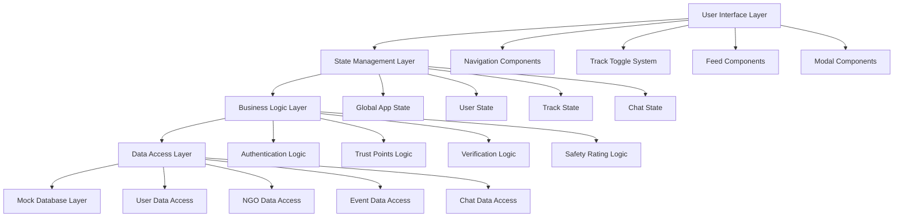
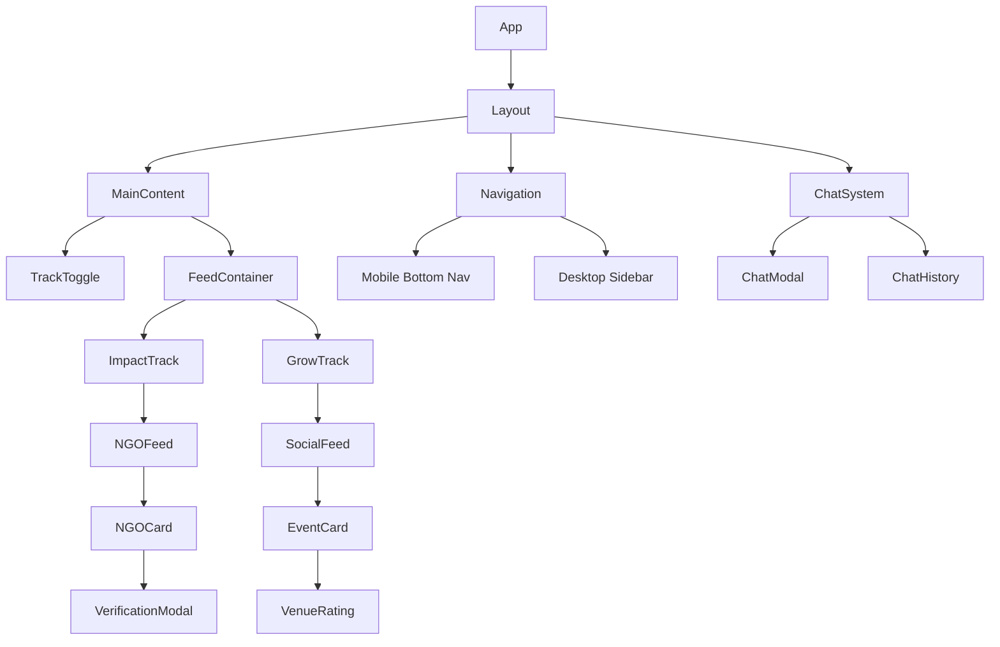

# Design Document: CommuniTree

## Overview

CommuniTree is a dual-track community platform that enables users to engage with their local community through two distinct pathways: community service (Impact track) and local entertainment (Grow track). The platform combines social networking with civic engagement, featuring verification systems, safety measures, and gamification to build trust and encourage participation.

The application follows a mobile-first responsive design approach, utilizing React with Tailwind CSS for styling and Lucide React for icons. The architecture emphasizes component reusability, clear separation of concerns, and efficient state management using React hooks.

## Architecture

### High-Level Architecture



### Component Architecture

The application follows a hierarchical component structure with clear separation between presentation and logic:



## Components and Interfaces

### Core Components

#### 1. App Component
- **Purpose**: Root component managing global state and routing
- **State**: User authentication, current track, trust points
- **Props**: None (root component)
- **Key Methods**: 
  - `handleTrackSwitch(track: 'impact' | 'grow')`
  - `updateTrustPoints(delta: number)`

#### 2. Layout Component
- **Purpose**: Responsive layout container with navigation
- **Props**: `children: ReactNode`, `currentUser: User`
- **Responsive Behavior**: 
  - Mobile: Bottom navigation + full-width content
  - Desktop: Sidebar navigation + main content area

#### 3. TrackToggle Component
- **Purpose**: Central toggle between Impact and Grow tracks
- **Props**: `currentTrack: 'impact' | 'grow'`, `onTrackChange: (track) => void`
- **Visual States**: Deep emerald for Impact, bright amber for Grow
- **Implementation**: Controlled component using hidden checkbox pattern

#### 4. NGOCard Component
- **Purpose**: Display NGO information with verification status
- **Props**: `ngo: NGO`, `onVerify: (id: string) => void`, `onVolunteer: (ngo: NGO) => void`
- **Features**: 
  - Verification badge display
  - Volunteer button with chat integration
  - Responsive card layout

#### 5. EventCard Component
- **Purpose**: Display social events with safety information
- **Props**: `event: Event`, `onRSVP: (event: Event) => void`, `onChat: (event: Event) => void`
- **Features**:
  - Color-coded venue rating system
  - RSVP functionality with trust points warning
  - Chat integration for event coordination

#### 6. ChatModal Component
- **Purpose**: Universal chat interface for NGOs and events
- **Props**: `isOpen: boolean`, `context: NGO | Event`, `onClose: () => void`
- **Features**:
  - Context-aware messaging (NGO vs Event)
  - Message history persistence
  - Real-time message display

### Interface Definitions

```typescript
interface User {
  id: string;
  name: string;
  email: string;
  trustPoints: number;
  verificationStatus: 'pending' | 'verified';
  chatHistory: ChatThread[];
  eventHistory: UserEvent[];
}

interface NGO {
  id: string;
  name: string;
  projectTitle: string;
  description: string;
  darpanId?: string;
  isVerified: boolean;
  contactInfo: ContactInfo;
}

interface Event {
  id: string;
  title: string;
  description: string;
  category: 'Poetry' | 'Art' | 'Fitness' | 'Reading';
  venue: Venue;
  organizer: User;
  attendees: User[];
  maxAttendees: number;
  dateTime: Date;
}

interface Venue {
  name: string;
  address: string;
  type: 'public' | 'commercial' | 'private';
  safetyRating: 'green' | 'yellow' | 'red';
  coordinates: [number, number];
}

interface ChatThread {
  id: string;
  participants: User[];
  context: NGO | Event;
  messages: Message[];
  lastActivity: Date;
}

interface Message {
  id: string;
  senderId: string;
  content: string;
  timestamp: Date;
  type: 'text' | 'system';
}
```

## Data Models

### State Management Strategy

The application uses React hooks for state management, following these patterns:

1. **Global State**: `useContext` + `useReducer` for app-wide state
2. **Local State**: `useState` for component-specific state
3. **Side Effects**: `useEffect` for data fetching and subscriptions
4. **Performance**: `useMemo` and `useCallback` for optimization

### State Structure

```typescript
interface AppState {
  user: User | null;
  currentTrack: 'impact' | 'grow';
  ngos: NGO[];
  events: Event[];
  chatThreads: ChatThread[];
  ui: {
    isLoading: boolean;
    activeModal: string | null;
    notifications: Notification[];
  };
}

interface AppActions {
  type: 'SET_USER' | 'SWITCH_TRACK' | 'UPDATE_TRUST_POINTS' | 
        'VERIFY_NGO' | 'RSVP_EVENT' | 'SEND_MESSAGE' | 
        'SHOW_MODAL' | 'HIDE_MODAL';
  payload: any;
}
```

### Data Persistence

For the prototype phase, data is managed through:
- **Local Storage**: User preferences, trust points, chat history
- **Session Storage**: Current session data, form inputs
- **Mock Database**: In-memory data structures for NGOs and events

### Trust Points Logic

```typescript
const TRUST_POINT_ACTIONS = {
  ORGANIZE_EVENT: 20,
  ATTEND_EVENT: 5,
  NO_SHOW: -10,
  VERIFY_IDENTITY: 10,
  REPORT_VIOLATION: -5
};

function updateTrustPoints(userId: string, action: keyof typeof TRUST_POINT_ACTIONS) {
  const delta = TRUST_POINT_ACTIONS[action];
  const newPoints = Math.max(0, Math.min(100, currentPoints + delta));
  return newPoints;
}
```

### Venue Safety Rating Logic

```typescript
function calculateVenueRating(venue: Venue): 'green' | 'yellow' | 'red' {
  switch (venue.type) {
    case 'public':
      return 'green'; // Parks, libraries, community centers
    case 'commercial':
      return 'yellow'; // Cafes, studios, restaurants
    case 'private':
      return 'red'; // Private homes, unlisted venues
    default:
      return 'red';
  }
}
```

## Correctness Properties

*A property is a characteristic or behavior that should hold true across all valid executions of a system—essentially, a formal statement about what the system should do. Properties serve as the bridge between human-readable specifications and machine-verifiable correctness guarantees.*

Before defining the correctness properties, I need to analyze the acceptance criteria from the requirements document to determine which ones are testable as properties.
